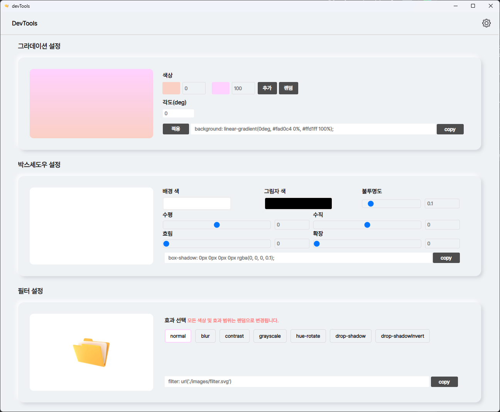

# cssDevTools  

**CSS 입문자를 위한 직관적인 스타일링 도구**  
그라데이션, 박스 셰도우, 필터 효과 등을 손쉽게 적용하고 코드를 생성할 수 있습니다.  

*2023년 고용노동부 지원 IT 국비교육 과정에서 강의 자료로 사용되었습니다.*  

## 작업기간
- 2023.06.12 ~ 2023.06.13

## 주요 기능  

| 기능  | 설명 |
|-------|------|
| 그라데이션 | CSS 그라데이션코드 생성 및 미리보기 |
| 박스 셰도우 | 박스 그림자 코드 생성 및 미리보기 |
| 필터 | 이미지 필터 효과 코드 생성 및 미리보기 |

## 실행 화면  

